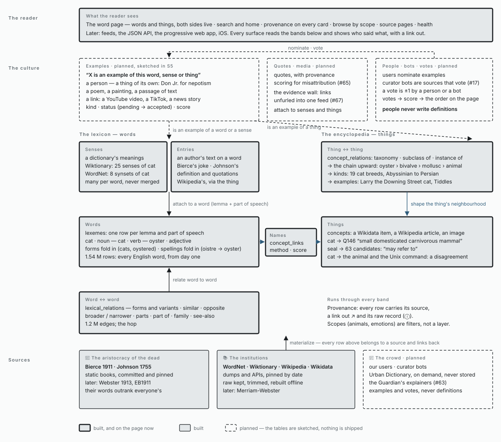

# Wordhoard *(working title)*

> Every word, every source, one page. An aggregator of dictionaries, encyclopedias and the culture, layered by who did the defining: the dead, the institutions, the crowd.

Internal name: `devils_dictionary` (the Phoenix app, the repo). Product name is provisional; see [Naming](#naming).

This file is the **living record** of the project: what it is, what it is not, the decisions we've made, and what we plan to build next. Update it whenever a decision changes. The current implementation spec is [issue #69](https://github.com/razrfly/dictionary/issues/69).

---

## What it is

- **An aggregator, not an author.** We do not write definitions. We absorb every word from open sources, keep a short definition and a link back for every source that has one, and layer sources on top of each other so the reader sees who defined what, and how they disagree.
- **Complete first, deep later.** The lexicon (every English headword) exists from day one. Enrichment (senses, encyclopedia entries, links, media) is added scope by scope.
- **Provenance on every row.** Nothing appears on screen without the source it came from, a link out, and a way to see the raw record.
- **Living.** Sources are re-absorbed; new words, changed senses and new examples surface as feeds.
- **Interactive on top.** Once the backbone holds, people (and curator bots) attach examples, media and votes to words: *nepotism* gets its public figures, *situationship* gets its TikToks. The backbone stays read-only; the culture annotates it.
- **An app in the end.** Backend first, then an API, then a progressive web app and an iOS app. Think Instagram of an encyclopedia: a word of the day with its evidence, not a wall of text.

## What it is not

- Not Wikipedia. We store summaries and links, not articles. Full text is imported only from public-domain dictionaries (Webster 1913, Johnson 1755, Bierce, EB1911).
- Not a new dictionary. Our "definitions" are other people's, attributed.
- Not commercial. Only openly licensed and non-commercial-permitted sources; nothing unlicensed is bulk-stored or redistributed.

---

## The backbone

```
sources ──► source_records (raw, trimmed, hashed, linked) ──► materialize (pure, one transaction)
                                                                      │
              ┌───────────────────────────────────────────────────────┴──────────────────┐
              ▼                                                                          ▼
   LEXICON: lexemes (lang · lemma · pos) · senses · entries · lexical_relations   ENCYCLOPEDIA: concepts (QID) · concept_relations
              └──────────────────────── concept_links (method · confidence · status) ────┘
                                              ▲
                     scopes (animals …) · examples · media · votes · users · bots  (layers, later)
```

Three ideas carry everything:

1. **Words and things are different tables.** Dictionaries attach to words (lemma + part of speech). Encyclopedias attach to things (Wikidata QID). They meet only through typed, scored links.
2. **Tier is a property of the source.** 👑 *Aristocracy of the Dead* (Bierce, Johnson, Webster 1913, EB1911) · 📚 *The Institutions* (Wiktionary, WordNet, Wikidata, Wikipedia, Merriam-Webster) · 📱 *The Crowd* (Urban Dictionary, the Guardian's explainers, our own users). Add a source, and the UI already knows how to dress it.
3. **Raw first.** Every absorbed record is kept (trimmed to the fields we use) so every derived row can be rebuilt with the network off.

Patterns are borrowed from [Cinegraph](https://github.com/razrfly/cinegraph): raw JSONB per record, a behaviour per source, idempotent materialization, terminal-state predicates, an import dashboard, health checks.

## The map

Every layer of the model, from the sources at the bottom to the votes at the top, and where each band stands. Read it upward: each band sits on the one below it. The full page — the legend, the *nepotism → Don Jr.* trace through every band, and the table of what was asked for against where it lives — is in [`docs/map/`](docs/map/README.md), with the diagram as [SVG](docs/map/wordhoard-map.svg), [PNG](docs/map/wordhoard-map.png) and [PDF](docs/map/wordhoard-map.pdf).

[](docs/map/README.md)

Three things to take from it. **Words and things are different tables** that meet only through scored links: definitions and word-to-word relations attach to words; the chain, the kinds and the instances attach to things; the culture attaches to all three. **A definition is what a source says about a word; an example is what the culture attaches to a thing** — Don Jr. exemplifies nepotism the practice, not the string — so the thing side of the word page (U1b) precedes the culture layer. **Nothing appears without a source, and the crowd nominates and votes but never defines.**

<details>
<summary>The same map as text (Mermaid), for diffs</summary>

```mermaid
flowchart BT
  subgraph sources [Sources — who says it]
    A["👑 Aristocracy of the dead<br/>Bierce 1911 · Johnson 1755"]
    I["📚 Institutions<br/>WordNet · Wiktionary · Wikipedia · Wikidata"]
    C["📱 The crowd (planned)<br/>users · curator bots · Urban Dictionary · the Guardian"]
  end
  subgraph lexicon [The lexicon — words]
    W["lexemes<br/>one row per lemma + part of speech<br/>forms and spellings fold in"]
    S["senses · entries<br/>a source's definitions of a word<br/>many per word, never merged"]
    R["lexical_relations<br/>forms · similar · opposite · broader / narrower<br/>parts · family · see-also"]
  end
  subgraph encyclopedia [The encyclopedia — things]
    T["concepts<br/>a Wikidata item, a Wikipedia article, an image"]
    TR["concept_relations<br/>taxonomy · subclass of · instance of<br/>the chain, the kinds, the examples of a thing"]
  end
  L["concept_links<br/>word → thing · method · confidence<br/>may refer to · disagreement"]
  subgraph culture [The culture (planned; tables sketched in S5)]
    E["examples<br/>X is an example of a word, sense or thing<br/>a person (a thing of its own), a text, a URL"]
    Q["quotes with provenance (issue 65)<br/>the evidence wall of media (issue 67)"]
    V["users · curator bots · votes ±1 → score<br/>people never write definitions"]
  end
  P["What the reader sees<br/>word page · search · browse · sources · health<br/>later: feeds, API, PWA, iOS"]
  sources -->|materialize| W
  sources --> S
  sources --> T
  S -->|attach to lemma + pos| W
  R -->|word ↔ word| W
  W -->|names| L
  L --> T
  TR -->|thing ↔ thing| T
  E -.->|of a word or a sense| W
  E -.->|of a thing| T
  Q -.-> S
  V -.->|nominate · vote| E
  lexicon --> P
  encyclopedia --> P
```

</details>

Where it stands (2026-09-07): the lexicon and its relations are built and on the word page (U1a); the encyclopedia side is built in the data and goes on the page next (U1b); the culture is planned — the `users` + `examples` + `votes` migration was written, applied, diffed and rolled back in S5 to prove it touches none of the thirteen tables.

---

## Status

**MVP-0, the walking skeleton, is in progress.** Spec: [#69](https://github.com/razrfly/dictionary/issues/69). Build tracker (reset procedure, sessions S0–S5, directory structure): [#70](https://github.com/razrfly/dictionary/issues/70). Six sources (Open English WordNet, Wiktionary via Kaikki, Wikidata, Wikipedia, Bierce and — as S5's extensibility proof — Johnson 1755), two scopes (Animals, and Emotions as the toy), thirteen tables, six plain pages, and a scorecard that `mix dd.score` computes. MVP-0 is done when every scorecard row passes.

| Milestone | State |
|---|---|
| Direction decided, schema reviewed | ✅ 2026-09-05 |
| Repo reset in place: Phoenix 1.8.13 / LiveView 1.2.11 on Elixir 1.19 / OTP 28, directory structure scaffolded (#70 S0a) | ✅ 2026-09-05 |
| S0b thirteen-table schema, `Materializer`, WordNet full + Wiktionary index, Animals scope (A2 ✅ 120,564 synsets · A3 ✅ 1,534,818 lexemes · A4 ✅ 21,277 scope lexemes · R1 ✅ 100%) | ✅ 2026-09-05 |
| S1 Wiktionary scoped (19,251 records, 31,116 senses, 105,731 relations), `Resolver`, parity, `Health` (A9 ✅ 100% · M1 ✅ 0 gaps · M4 ✅ 67.7% on real records · R2 ✅ 86.4% · X3 ✅ · A5 ⚠️ 83.5%, see #69) | ✅ 2026-09-05 |
| S1b `content_hash` taken before `trim/1` (changed_at now moves only when the source moves), `form_of` flag on 533,218 index rows, headword-first lookup; Health rows unchanged (A5 raw 83.5 % / amended 92.2 %, A9 100 %, M1 0, M4 67.7 %, R2 86.4 %) | ✅ 2026-09-05 |
| S2 Wikidata + Wikipedia (44,194 concepts, 44,072 entries, 38,206 taxonomy edges, 65,679 links), Oban, the linking ladder (A6 ✅ 100% · A7 ✅ 100% · A10 ✅ 93.7% · L2 ✅ 1,165 surfaced · L3 ✅ 77.3% · L4 ✅ 100% · M1 ✅ 0 gaps · **L1 ⚠️ 57.7%**, ceiling 68.1%, see #69) | ✅ 2026-09-05 |
| S2 audit + completion pass: Wiktionary re-absorbed on the grown scope (+2,176 records, +3,367 senses), Wikidata +66, links re-run; L1 58.4 % raw / **88.5 % of reachable**, A6 union 97.4 %, A7 100 %, A10 93.6 %, L3 77.2 %, R2 86.4 %, M1 0 gaps across 242,359 records | ✅ 2026-09-05 |
| S3 Bierce (997 entries, 247 verse blocks), `Health.Coverage` + `Health.Score`, `mix dd.health`, `mix dd.score` (A1 ✅ 5/5 · A8 ✅ 997, 93.0% already in the index · M2 ✅ identical over 271,296 records · M3 ✅ · O1 ✅ · O3 ✅ · O4 ✅ — **24 / 24 graded rows pass**) | ✅ 2026-09-05 |
| S3 audited (grade A): scorecard reproduced, 24 / 24 graded rows pass on 261 tests; one parse nit (three alternate-headword bodies) noted for the next data touch. **U0, S4b and S5 unblocked.** | ✅ 2026-09-05 |
| U0 Oatmeal theme ported by hand into `DevilsDictionaryWeb.Kit` (17 components), daisyUI removed, `/kit` dev-only, no kit source in git | ✅ 2026-09-06 |
| S4b read layer (`Lexicon.browse/search`, `Encyclopedia.taxon_*`, `Health.records/source_detail`) and four developer surfaces: `/s/:slug`, `/sources/:slug`, `/admin/imports`, `/health` (U5 ✅ 5/5 · X2 ✅ p95 72 ms · U4 ✅ at 375 px — **26 / 26 graded rows pass**, 322 tests); Commons image URLs and nine Bierce bodies fixed | ✅ 2026-09-06 |
| S4 audited in Chrome (U0 **A**, S4b **B+**): every page, filter, link-out and theme verified; two click-level defects (has/missing chips dead, `/health` abandons its own mount) and A5 v2 → **S4c** in #70 | ✅ 2026-09-06 |
| S4c fixes from the audit: chips carry `phx-value-slug`; the scorecard is `assign_async` + a ten-minute Cachex cache with a *recompute* button (health page dead render 3 ms, websocket kept); Wikidata shown as *linked · 16,014* from `concept_links` with its dead chips gone; no more `page=false`; **A5 v2 93.0 %** excl. 4,004 scientific names at a 90 % bar — all verified in Chrome, 322 tests | ✅ 2026-09-06 |
| U1–U3 the word page and the hop, home/search, provenance, fake-data mode (#71) — the rows R3 X1 U1 U2 U3 U6 | ⬜ |
| S5 the extensibility proof: **Johnson 1755** as the sixth source (42,726 entries, 37,235 headwords, **91.9 % already in the index**, 6,780 words of his own, 114,787 quotations, 114 alternates, 707 cross-references, 109 inflected forms, **0 migrations**), **Emotions** as a second scope built from one WordNet root with no code touched (809 lexemes, L1 37.2 % at ≥ 0.8), and the `users` + `examples` + `votes` migration written, applied, schema-diffed, rolled back and moved to `docs/sketches/` — **E1 E2 E3 green**. Two findings: **A7 v2** (graded on asserted concepts) and an unscoped `concept_qids/0` that makes scope N re-walk scopes 1..N−1 | ✅ 2026-09-06 |
| S5 audited (grade A−): every number re-measured, 29 / 29 graded rows with parity on 356 tests; E1–E3 hold; the second scope exposed the unscoped concept seed and the Animals-calibrated bars → S5c. **The backbone is complete; #70 can close; the 7 pending rows are all #71's.** | ✅ 2026-09-06 |
| S5c fixes from the S5 audit, landed with U1b: the concept seed scoped through `concept_links` (**emotions 72,108 → 414 seeds, 28,084 → 345 records, 16 min → 15 s**; animals 92,947 → 11,660), the Wikipedia concept pass scoped with it, the bars A4/A10/L1/L3 moved into `scopes.rules["bars"]` with Animals' numbers as defaults, L3 *n/a* when a scope has no root, `?scope=` on `/health` and `/sources/:slug`. Orphans left alone deliberately: deleting derived rows alone makes M1 report gaps, and the seed fix stops the growth. | ✅ 2026-09-07 |
| U1a the word page, word side (`aeedc85`): `/define/:slug` for every index word — headword, source cards by tier then year, WordNet per synset with its chain, every relation group from #71 §7 placed by the per-sense rule, the trail in the URL, ↗ on every card; `Lexicon.WordPage` in seven queries, p95 under 20 ms on *cat*; R3 X1 U1 U2 U6 ✅ — **33 / 33 graded rows**, 397 tests. Audited A−: verified in Chrome (placement rule on *cat*, two hops with the trail, redirect, miss, 375 px); Wiktionary's sense-scoped chips still pool per card, and the session left its work uncommitted and unreported. | ✅ 2026-09-06 |
| U1b the word page, thing side (`30a1e8c`): a `thing` on `%WordPage{}` — the concept card (label, description, image with attribution, ↗ Wikipedia, `Q…` ↗ Wikidata), the chain upward one parent per step (`parent_taxon` → `subclass_of`, `instance_of` only at the first), the kinds and examples that have a word, *may refer to*, and the disagreement plaque; three `Encyclopedia` reads, ten queries, p95 19 ms on *cat* and 12 ms on *human* (the worst hub). Plus the three U1a deductions: chips hang off the **sense** not the sense group, `scope_live_test` uses `WordFixtures`, and the scorecard forgets its page measurements between runs. **S5c rides here** and *joy* needed it. 422 tests; **animals 34 / 34, emotions 33 / 33** (was 30 / 33). | ✅ 2026-09-07 |

---

## Roadmap (living; reorder freely)

Everything below is designed for in the MVP-0 schema and adds tables rather than changing them.

**Layers (more sources)**
- [x] Johnson 1755 (LEME TEI-XML, CC BY 4.0) — landed in S5 as the extensibility proof
- [ ] Webster 1913 (GCIDE) · EB1911 (Britannica11 corpus)
- [ ] Wikidata lexemes dump (the P5137 word→thing bridge)
- [ ] Merriam-Webster (1k/day, non-commercial) · Urban Dictionary (on demand, attributed, never stored in bulk) · Datamuse
- [ ] Voltaire's *Philosophical Dictionary* · Diderot (link only) · the Guardian Gen Z terms (#63)
- [ ] More scopes: politics, food, internet slang. A scope is a `priv/scopes/<slug>.json` file and two task runs — `mix dd.scope.new`, then `mix dd.scope.build` (emotions, S5, proved it).

**Community**
- [ ] Users (Clerk or `phx.gen.auth`), roles
- [ ] **Examples**: "X is an example of this word" where X is a thing (a person, a company), a URL (a news story) or text; submitted by a person or a bot; voted on
- [ ] Votes with cached scores; moderation queue
- [ ] Curator bots with personalities (#17)
- [ ] Quotes with provenance scoring (#65)

**Media**
- [ ] Evidence wall (#67): paste a link, unfurl it, attach it to a word
- [ ] Media providers as sources: YouTube, TikTok, Instagram, X, Giphy, Unsplash, Spotify/Genius, TMDb (via Cinegraph), news
- [ ] Images on every word and thing (Wikipedia thumbnails, Wikidata P18, Commons)

**Product**
- [ ] Feeds: new words, changed senses, top examples, word of the day
- [ ] Minimum word-hopping UI on the Oatmeal theme, theme boilerplate first, with a labelled fake-data mode (#71)
- [ ] Design pass on the word page (#66): the tier styling *is* the joke, on top of #71
- [ ] JSON API (then GraphQL) over the same contexts
- [ ] Progressive web app
- [ ] iOS app
- [ ] Concept pages, disambiguation pages, etymology trees

**Ops**
- [ ] Kamal deploy to the Argus NUC as a second database
- [ ] Daily re-absorb and drift checks (Cinegraph-style sweepers)

---

## Decision log

| Date | Decision | Where |
|---|---|---|
| 2026-09-05 | Absorption-first: absorb the open word graph, layer dictionaries on top. Supersedes the API-first plan in #68. | #69 |
| 2026-09-05 | Restart the code from `mix phx.new`, **in place** in this repo and directory; keep the repo and issues. The Rails app is already tagged `ruby-rails-archive`; the skeleton gets `phoenix-skeleton` before the wipe. | #69, #70 |
| 2026-09-05 | One app, one database; neutral core contexts `Absorb` / `Lexicon` / `Encyclopedia`. | #69 |
| 2026-09-05 | Full lexeme index from day one; enrichment scoped. Test scope: Animals. | #69 |
| 2026-09-05 | No sense alignment across sources; join only through concepts. Disagreement is content. | #69 |
| 2026-09-05 | Non-commercial. Open sources only in MVP-0. | #69 |
| 2026-09-05 | The word is the page (`/define/:slug`, all parts of speech, all sources). | #69 |
| 2026-09-05 | Tier is a column on `sources`, a theme not the core. | #69 |
| 2026-09-05 | Pinned snapshots; no daily sync yet. | #69 |
| 2026-09-05 | Links, not content: short gloss + URL for living sources; full text only for public-domain dictionaries; raw records trimmed. | #69 v3 |
| 2026-09-05 | Humans and bots are sources. Examples and media are edges from words to things/URLs with provenance and votes. | #69 v3 |
| 2026-09-05 | Backend first, then API, then PWA, then iOS. | this file |
| 2026-09-05 | MVP-0 is built in six to eight sessions (S0–S5), each ending with numbers posted on #70. | #70 |
| 2026-09-05 | Always generate and stay on the current Phoenix release; toolchain pinned per project in `.tool-versions`. Reset done with `phx_new` 1.8.13. | #70 |
| 2026-09-05 | S0 audited. Animals scope measured at 21,277 lexemes (estimate was 8k–12k): kept whole, enriched in reason order; the O2 time budget is split into dump absorbs (≤ 2 h) and on-demand fetches (reported). WordNet is the plus edition; `wordnet_wikidata` joins the linking ladder. | #69 v6, #70 |
| 2026-09-05 | S1: **A5 cannot pass as specified** — Wiktionary attests 83.5% of the Animals scope, and the 3,504 misses are 1,995 Linnaean binomials plus 1,299 other multiword names that Wiktionary files under Translingual, not English. Reported rather than engineered around; amendment proposed on #69. `trim/1` also narrows categories instead of only dropping keys, which is what takes M4 from 45.6% to 67.7% on real records. | #69, #70 |
| 2026-09-05 | S1 audited (grade A-) and fast-forwarded into `main`. A5 amendment accepted: the row now excludes lemmas Wiktionary files as Translingual (binomials) and measures 92.2 %; the raw 83.5 % and the 1,995 binomials stay reported. | #69 v7, #70 |
| 2026-09-05 | S1b: the record hash is taken on the payload as fetched, before trimming, so tightening what we keep never reads as a change at the source (19,250 false stamps reset once). Bare index rows that are only inflected forms yield to the word they inflect; a bare headword keeps its page only on an exact-case match. | #69 v7 open items, #70 |
| 2026-09-05 | S2: **L1 cannot reach 70 %** — only 68.1 % of the Animals scope has *any* concept link, because 6,840 of its lemmas have no English Wikipedia article at all (`soup-fin`, `trochid`, `prophaethontid`). 57.7 % clear the ≥ 0.8 bar. The QID rungs alone reach 25.2 %, so a corroboration step raises a title match when a taxon name, a QID rung or a gloss overlap agrees; both numbers are reported. Another rung cannot help: the words have no article. | #69 §7 L1, #70 |
| 2026-09-05 | S2: the two API sources use the **batched** endpoints (`wbgetentities`, 50 ids; the Action API, 20 titles) rather than #69 §2's pinned per-item URLs. 100,201 fetches became 7,380 requests and 1 h 37 m instead of ≈ 5.6 h, with redirect resolution, the disambiguation flag and `wikibase_item` included rather than inferred. The per-item URL stays as the record's link back. | #69 §2, #70 |
| 2026-09-05 | S2: a Wikipedia record is keyed by **the thing we asked about** — the probed lemma, or `concept:<QID>` — not by pageid. A lemma with no article has no pageid to key an absent marker on, and two lemmas legitimately redirect to one page. | #69 §4, #70 |
| 2026-09-05 | S2: `wikidata_taxon` grew the Animals scope from 21,277 to **25,393** lexemes. #69 §3's enwiki-sitelink requirement is applied (8,870 matched) and the count without it reported (9,290), because the article usually sits on the everyday concept rather than on the taxon item. | #69 §3, #70 |
| 2026-09-05 | S2 audited (grade A−). Accepted: L1 measured against the reachable set (articles exist), L3 and A10 over asserted links, L4 by lemma, A7 as "answered", records keyed by what was asked, batched endpoints, `name` as nominal, the corroboration pass with both numbers printed. Rule learned: when a scope grows, re-run the dictionary half too. | #69 v10, #70 |
| 2026-09-05 | Bierce source verified: Project Gutenberg #972 is the complete 1911 text and the only public-domain one (the 2000 *Unabridged* is a copyrighted compilation; Wikisource is the same text). Parse the **HTML edition** (`priv/sources/bierce/972-h.htm`), as the Rails app did: one paragraph per entry, verse in `<pre>`, attributions as short paragraphs. 959 entries + EUCHARIST, which the HTML mis-wraps. | #70 S3 notes |
| 2026-09-05 | S3: **Bierce holds 997 entries, not the 959 recorded** (or the 966 #69 A8 assumed). The single regex everyone had used misses 21 stubs whose whole definition is the verse below them, the six letter essays that open chapters I, J, K, T, W and X (chapter X is *only* that, and it was gluing itself to chapter W), `HABEAS CORPUS.`, `CUI BONO?`, `FORMA PAUPERIS.`, `LL.D.`, `R.I.P.`, and one missing comma in the 1911 source. The Rails seed is a cautionary baseline, not a reference: it never visits a `<pre>`, so it drops all 247 verse blocks and every attribution. | #69 §7 A8, #70 |
| 2026-09-05 | S3: for a source with structure, **`absorb/2` segments and `materialize/1` parses**. `raw` holds the entry's own markup; deciding which paragraphs, verse blocks and attribution lines belong to which entry needs the whole document, so it happens once, at absorb, as WordNet computes its inverse edges. The payoff is that a parser bug is fixed with `mix dd.materialize --source bierce --all`, network off, file never re-read — which is M2 in practice rather than in principle. | #69 §5, #70 |
| 2026-09-05 | S3: A8's "entries with `lexeme_id`" is **100 % by construction** — `materialize/1` creates the lexeme when the index lacks it, so an unattached entry cannot exist. The number that carries information is the **index hit rate**: 93.0 % of Bierce's headwords were words another source already attested, and the other 70 are words he invented (`WHANGDEPOOTENAWAH`). | #69 §7 A8 |
| 2026-09-05 | S3: **the Wikipedia lemma probe was never incremental.** It re-fetched all 23,784 scope lemmas on every run (90 minutes to learn nothing), and the disambiguation pass re-read all 1,775 "may refer to" pages with it — which is what restamped `changed_at` on 1,352 records in S2. Both now skip what they have already asked about; `--refresh` is the way back in. An expired absent marker is still retried. | #69 §5, #70 |
| 2026-09-05 | S3 audited (grade A). Accepted: A8 = 997 with the index hit rate as its informative metric; L1's reachable set computed by `Health.links/2` (82.5 % of 18,028); A1 pins an API by its last finished run; M2 read from `--all` runs; X3 as named probes. The scorecard has four statuses so it is complete from its first run. | #69 v11, #70 |
| 2026-09-05 | The first UI is a new build, not the skeleton's: Oatmeal theme applied and verified on a `/kit` page before any product page; the minimum use case is the hop between related words with Bierce first; layers that do not exist yet may be shown as clearly labelled samples in a dev-only fake-data mode; never commit the kit source. | #71 |
| 2026-09-06 | S4 audited (U0 A, S4b B+). Every page was driven in Chrome, not read from reports: the has/missing chips never applied (LiveView overwrites a `phx-value-value` on a `<button>` with the button's own empty `.value`) and `/health` ran a 4.5 s scorecard inside `mount/3`, which the 2.5 s long-poll fallback abandons, so two visitors loop on *Something went wrong*. Both go to a short **S4c**; the lesson is that a URL test is not a click test. |
| 2026-09-06 | **A5 v2.** The Translingual exclusion widens from the binomial regex to every scientific name at any rank (the lemma equals a linked concept's `taxon.scientific_name`): Wiktionary files *Archilochus*, *Paguridae* and *Therapsida* the way it files binomials, and the 85.0 % that sat exactly on the bar was those names counted as misses. Measured 93.0 %; bar raised to 90 %. |
| 2026-09-06 | Three UI rules. **Nothing slower than the long-poll fallback runs in `mount/3`** (heavy figures go to `assign_async`, cached). **Wikidata is not a word badge**: it never enters `lexemes.source_ids` because it attests concepts; pages show it as *linked* through `concept_links` and, on the word page, through the concept card. **Never use `value` as a `phx-value-*` key.** |
| 2026-09-06 | S5 planning. **A static source is a committed file when it is under about 10 MB compressed** (Johnson's LEME TEI-XML goes in gzipped, CC BY 4.0, pinned by edition and checksum); larger dumps stay in `data/` with a pinned checksum. **The extensibility rows are scored without footnotes:** S5a first makes the three hard-coded entry points generic and adds `mix dd.scope.new` over `priv/scopes/<slug>.json`, so E1 is one source row, one module, one registry line, fixtures and tests at zero migrations, and E2 is a scope with no code touched. |
| 2026-09-06 | **A7 v2** (#69 v13). The second scope broke A7 as it stood, and the S3 audit had already said it would: *"for the next scope consider limiting the concept pass to asserted concepts plus candidates promoted to 0.6, and reporting A7 on that population."* Building `emotions` grew the concept table from 44k to 90,481 sitelinked rows, of which **54,273 have no link to any scope word at all** — they are things a disambiguation page merely mentioned, and every summary fetched names more, so the denominator grows faster than any pass can fill it. A7 is now graded on the concepts a scope word actually links to at `auto`/`confirmed`: **10,098 / 10,098 = 100 %**, with 70,224 / 90,481 = 77.6 % including candidates reported beside it. | #69 §7 A7, #70 S5 |
| 2026-09-06 | **Open defect, found by the second scope, not fixed here.** `Wikidata.seed_qids/2` unions an unscoped `concept_qids/0` — `Repo.all(from c in Concept, select: c.qid)`, the whole table — so scope N re-walks every concept scopes 1..N−1 introduced. An 809-lexeme `emotions` scope seeded **72,108 QIDs** and fetched 28,084 records in 16 minutes. With one scope the bug is invisible, because the whole table *is* that scope; the extensibility proof is what made it visible. Two candidate fixes: seed only concepts this scope's own probes introduced, and stop chasing 0.40 disambiguation candidates until the linker promotes them. Left for its own session rather than slipped into S5's tail. | #70 S5 |
| 2026-09-06 | **S5, E1.** Adding Johnson cost one `sources` row, one `people` row, one line in `Absorb.@modules`, one module, fixtures and tests. `schema_migrations` stayed at **2**, which is what E1 now measures rather than asserts — every enum-like column is a plain string backed by `Ecto.Enum`, so even a new tier or relation type would cost none. The three entry points that hard-coded the five slugs (`health_live.ex`'s coverage list, `dd.fixtures.capture`'s dispatch, and the scope rows) were made generic **first**, so the claim needs no footnote. | #69 §7 E1, #70 S5 |
| 2026-09-06 | **Johnson's headword rule.** Not "everything before the first period" — that is wrong for `To SINK pret I sunk` (no period after the headword) and for `A. Bp.` (all periods). Not "everything before the first lower-case word" either — that truncates all 565 phrase headwords (`CAT in the pan`, `LILY of the Valley`, `SENSITIVE Plant`). The run ends at a full stop **or at a grammar marker**, and the marker vocabulary was read off the file rather than imagined: `n` (972), `adj` (639), `v` (399), `adv` (240) leaking out of `<class>`, then `pret`, `part`, `plur`, `pronoun`. A comma-separated part is an alternate only if it survives the rule whole and every word of it is capitalised — otherwise `METHO'UGHT, the preterite of methinks` puts that sentence in the lexicon as a word, which the first pass did, 167 times. | #70 S5 |
| 2026-09-06 | **Every scope is a file.** `priv/scopes/<slug>.json`, read by `Catalog.scopes/0`; `animals` moved there too, 231 pinned Wiktionary categories and all. There is no scope defined in Elixir to point at any more, so E2 measures what it claims: two scopes built, every member carrying a reason, zero code changed. `mix dd.scope.new <slug>` writes the file and the row; with no options it reads a file someone else committed. | #69 §7 E2, #70 S5 |
| 2026-09-06 | **E3 is an experiment, not an assertion.** `users` + `examples` + `votes` were generated with `mix ecto.gen.migration`, applied to the full development database, diffed against a `pg_dump -s` taken before them, and rolled back. The diff adds three tables, seven indexes and two check constraints and changes **no column, index or constraint of the thirteen**; four foreign keys point into `lexemes`, `senses`, `concepts` and `sources` without adding anything to them. The file now lives at `docs/sketches/community_layer_migration.exs`, where `mix ecto.migrate` cannot see it and `mix precommit` cannot apply it to the test database — deleting it outright would have made the claim unfalsifiable. `users` is included deliberately: there is no auth scaffolding, so a proof that skipped the awkward half would not be one. | #69 §4 §7 E3, #70 S5 |
| 2026-09-06 | **Deleting a source's records is not a rollback plan.** Re-absorbing Johnson after a parser fix meant clearing 42,726 `source_records`, and `senses.source_record_id` has no index, so the `nilify_all` cascade seq-scans 247k senses per deleted row — cancelled after twelve minutes. The absorb upserts on `(source_id, external_id)`, so the working move is: re-absorb over the top, then delete only the rows the new run did not re-stamp (293 of them) and the lexemes left orphaned (167). Worth an index if a source is ever re-absorbed often. | #70 S5 |
| 2026-09-06 | S5 audited (A−). **What Animals proved:** the backbone is generic — six sources of four access kinds, thirteen tables unchanged through seven sessions, every scope a JSON file, and `emotions` (no taxonomy) running the identical pipeline. **What it did not:** the scorecard's bars and L3 are Animals' numbers, the concept seed re-walks the whole table on every new scope, and abstract nouns link at 37 % where animals link at 59 % — expected, and now measured. The taxonomy stays as one relation type among three, not the spine. |
| 2026-09-06 | **#71 rewritten as v2** after S5. The word page must offer *every* relation kind the sources assert — similar, opposite, broader, narrower, parts, part of, family, variants, an author's cross-references — with WordNet's edges split per sense, plus a **things** panel (concept card, chain, kinds and examples, *may refer to*, disagreement) so a word reaches other words through what it names as well as through what it means. The page is scope-free. Acceptance is two ten-hop walks, *oyster* and *joy*. "The hop" is UI copy only. #71 is the tracker from here; the closing scorecard lands with U3. |
| 2026-09-06 | **#71 v3: four sessions, not three or seven, and the first one mapped in full.** U1 splits at its seam into U1a (the word page, word side) and U1b (the thing side, which takes S5c). U1a's plan fixes the **placement rule** — a relation with a `from_sense_id` renders under its sense inside the source card, one without renders in the page-level *Related words* for its part of speech — and the chain is walked synset to synset, never lexeme to lexeme (which yields *oyster › bivalve › allocation › abstract entity*). Bierce's and Johnson's markdown bodies get a renderer (Earmark, pure Elixir). No sub-issues: one tracker, edited from its live body. |
| 2026-09-06 | U1a audited (A−). Two decisions the session made inside the plan's rules and that stand: **within a tier, older first** (Johnson 1755 above Bierce 1911 — the rule said tier then year), and **no markdown library**: the two 👑 corpora use three constructs (paragraphs, `> ` quotations, `*emphasis*`), a scan of all 43,723 bodies confirms it, Earmark is retired on Hex and MDEx is a NIF, so a 40-line renderer with escaping first does the job. One rule half-kept: sense-scoped relations sit under the *synset* for WordNet but pool per card for Wiktionary, which puts *cat*'s slang synonyms beside its feline ones — fixed in U1b. |
| 2026-09-07 | **The map** (README § The map), drawn to check the model against Holden's description of the goal: a dictionary plus an encyclopedia, definitions on words, every relation kind between words, things with their hierarchies, and on top the culture — examples (a person, a poem, a video), quotes, media, votes. Every item has a place and nothing built points elsewhere. The distinction that matters: a definition is what a source says about a **word**; an example is what the culture attaches to a **thing** (or to a word or sense when there is none). So U1b's thing side precedes the culture layer, and the crowd never writes definitions. |
| 2026-09-07 | **U1b: the placement rule is per sense, not per sense group.** WordNet made the bug invisible — one synset is one group is one sense — so grouping the chips at group level looked right until Wiktionary, whose senses all share the nil group key, listed *kitty* and *tabby* beside *bloke* and *prostitute* on *cat*. Relations now hang off the sense and render inside its `<li>`. | #71 U1b |
| 2026-09-07 | **The thing's chain is not the taxon chain.** `taxon_chain/2` walks `parent_taxon` only and returns nothing for anything that is not alive, which is most of a second scope. `Encyclopedia.chain/2` prefers `parent_taxon`, falls back to `subclass_of`, and allows `instance_of` **only at the first step** — an instance climbs to its class and continues by subclass, because following `instance_of` at every step walks *Larry* up to *abstract entity*. One parent per step, as the synset chain does: the concept graph is a DAG and a plain recursive walk up from *oyster* returns eighteen rows for a walk of ten. | #71 U1b |
| 2026-09-07 | **Kinds and examples are only the children that have a word.** The panel exists for the hop, so a chip that cannot be clicked is furniture: *cat* has four named individuals under it (*Larry*, *Tiddles*) and not one is a word, while ten of its nineteen subclasses are. Capped at twelve with the **exact** count beside them — the count is the expensive half on a hub (Q16521 *taxon* has 7,141 worded children and answers in 85 ms), but no word links to that concept; the worst a reader can reach is *human* at 12 ms. | #71 U1b |
| 2026-09-07 | **The scorecard's bars belong to the scope.** A4's 7,500, A10's 80 % and L1's 70 % were measured on 21,277 animals with a Wikipedia article each; grading an 809-word scope of abstract nouns by them grades the scope, not the pipeline. They move to `scopes.rules["bars"]` with today's values as the defaults — *emotions* declares 500 / 55 % / 45 %, each set just under what it measures so the row catches a regression rather than announcing a pass. L3 goes further and **reports** rather than grades when a scope has no `wikidata_root`: *emotions* is not under Animalia and never will be. | #70 S5c |
| 2026-09-07 | **The scoped seed is what gave *joy* a card.** 265 of the 322 concepts the emotions scope links to had no `wikidata` record at all — they were introduced by the Wikipedia pass *after* the Wikidata pass ran, so their claims were never fetched, and 23 of 322 had any relation at all against 8,880 of 10,386 for animals. Fixing the seed made the re-absorb affordable (414 seeds, 345 records, 15 s), and *joy* now reads *a kind of happiness* with *joie de vivre* under it. **Open, on #70:** the chain is one step deep for most of them, because `P279` is recorded and never chased — 97 of 322 reach one step, 44 reach two. Chasing it is bounded work and its own session, not a tail. | #70 S5c, #71 U1b |
| 2026-09-07 | **The map lives in the repo**: `docs/map/` holds the diagram as SVG (embedded in the README), PNG and PDF, plus the page with the trace and the table. The README gained a *Reference* section so it works as the hub for everything useful: the map, the three issues, the sketches, the scopes, the checked-in sources, the scorecard. |

---

## Reference

- **The map** — [`docs/map/`](docs/map/README.md): the model in seven bands, with the trace and the table. SVG, PNG, PDF, HTML.
- **The spec** — [#69](https://github.com/razrfly/dictionary/issues/69): decisions, schema, pipeline, the scorecard (§7), the build order. Its first comment is the v1 research draft: every source evaluated, the probe log, the licensing table.
- **The build history** — [#70](https://github.com/razrfly/dictionary/issues/70): sessions S0–S5 with per-session expectations, audit notes and grades; the reset procedure; the directory structure.
- **The UI tracker** — [#71](https://github.com/razrfly/dictionary/issues/71): the word page and the hop, session by session (U0 ✅, U1a ✅, U1b, U2, U3), wireframes, the relation map (§7), acceptance criteria.
- **The community layer, sketched** — [`docs/sketches/`](docs/sketches/README.md): the `users` + `examples` + `votes` migration that was proven to fit and deliberately not shipped.
- **Scopes** — [`priv/scopes/`](priv/scopes/): every scope is a JSON file; `mix dd.scope.new` creates one, `mix dd.scope.build` fills it.
- **Sources checked in** — [`priv/sources/`](priv/sources/): Bierce (Gutenberg #972, HTML) and Johnson 1755 (LEME TEI-XML, gzipped), each pinned.
- **The scorecard** — `mix dd.score --scope animals` (add `--skip-parity` for the fast version); `/health` shows the same rows.

## Naming

`devils_dictionary` stays as the internal/app name. The product needs its own name. Working title: **Wordhoard** (Old English *wordhord*, the poet's hoard of words; it says "aggregate" and gives the dead their due). Shortlist to react to: **Glossa** (a *gloss* is a short definition, which is exactly what we keep), **Marginalia** (the culture writing in the margins of the canon), **Polysemy** (many meanings, the thesis), **Necrolex** (too on the nose). Decide before the app. Note: the obvious `.com` / `.app` / `.io` domains for every name on this list were already registered on 2026-09-05, so the real brainstorm has to start from what is available.

---

## Licensing and attribution

| Source | License | We show |
|---|---|---|
| Wiktionary, Wikipedia, EB1911 (Britannica11) | CC BY-SA 4.0 | attribution + link on every card; derived text stays share-alike |
| Open English WordNet | CC BY 4.0 | attribution |
| Wikidata | CC0 | attribution anyway |
| Bierce, Johnson (LEME transcription CC BY 4.0), Webster 1913 (GCIDE, GPL package), Voltaire | public domain text | credit the transcription |
| Merriam-Webster, Datamuse | non-commercial API terms | attribution; never bulk |
| Urban Dictionary | unlicensed | on demand, attributed, linked, never stored in bulk or exported |

---

## Development

Toolchain is pinned in `.tool-versions` (Elixir 1.19 on OTP 28; `mise` picks it up automatically). Phoenix 1.8.13, LiveView 1.2.11, Oban 2.24, Req 0.7. Dumps live in `data/` (ignored). The old dev database from the skeleton still exists: run `mix ecto.drop` once before the first `mix ecto.create`. After S0:

```bash
mix setup                                  # deps, db, assets

mix dd.absorb wordnet                      # full corpus
mix dd.absorb wiktionary --index           # ~1.5M bare lexemes + forms
mix dd.scope.build animals                 # scope_lexemes, with reasons
mix dd.absorb wiktionary --scope animals   # senses, relations, trimmed raw
mix dd.resolve                             # relation targets, canonical variants

mix dd.absorb wikipedia --scope animals    # title probes → concepts, entries, images
mix dd.absorb wikidata --scope animals     # entities, taxonomy, the taxon bridge
mix dd.scope.build animals                 # again, WITHOUT --reset: adds wikidata_taxon
mix dd.absorb wikipedia --scope animals    # again: the lemmas the taxon rule added
mix dd.absorb wikidata --scope animals     # again: the QIDs those probes found
mix dd.absorb wikipedia --scope animals --concepts   # a summary for every concept (A7)
mix dd.link --scope animals                # the ladder → concept_links; prints L1

mix dd.absorb bierce                       # 997 entries, verse, cross-references
mix dd.absorb johnson                      # 42,726 entries, quotations, cross-references
mix dd.resolve                             # their "See X" targets

# A second scope costs a file and two task runs, no code (E2)
mix dd.scope.new emotions --name Emotions --rules '{"wordnet_roots":["oewn-00026390-n"]}'
mix dd.scope.build emotions                # 809 lexemes from one WordNet root
mix dd.absorb wiktionary --scope emotions  # then wikidata, wikipedia, dd.link as above

mix dd.materialize --dry-run               # parity: raw vs derived, no network (M1)
mix dd.materialize --all                   # rebuild every derived row offline (M2)
mix dd.health                              # coverage, resolution, links, parity
mix dd.score                               # the MVP-0 scorecard, PASS/FAIL with actuals
mix phx.server                             # http://localhost:4007 (4000–4005 belong to sibling projects)
```

Order matters three times. Wikidata is seeded from the QIDs the Wikipedia pass finds,
so Wikipedia goes first. The second `dd.scope.build` must **not** take `--reset`,
because reasons union and the taxon rule only ever adds. And the encyclopedia half
converges rather than running once: the taxon rule grows the scope, the new lemmas need
probing, and their pages name new QIDs — two rounds took it from 21,277 to 25,393
lexemes and the third round added 49, so two is enough in practice. Every pass is
incremental; a re-run costs only what it does not already have.

Conventions live in `AGENTS.md`. Every task prints numbers and writes an `import_runs` row. Tests run offline on checked-in fixtures for `cat`, `dog`, `oyster` and — for the two API sources — `seal`, which is a disambiguation page.
