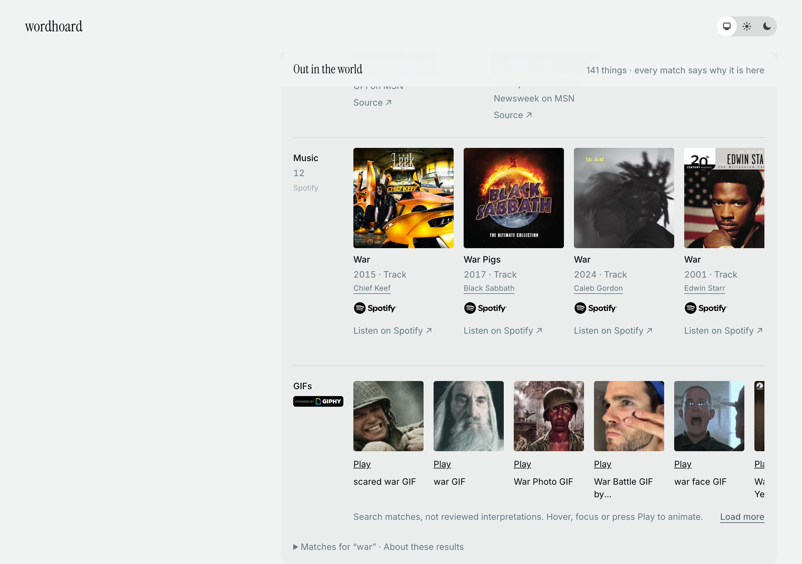
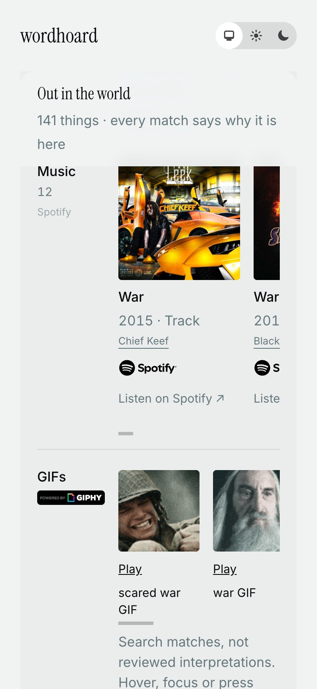
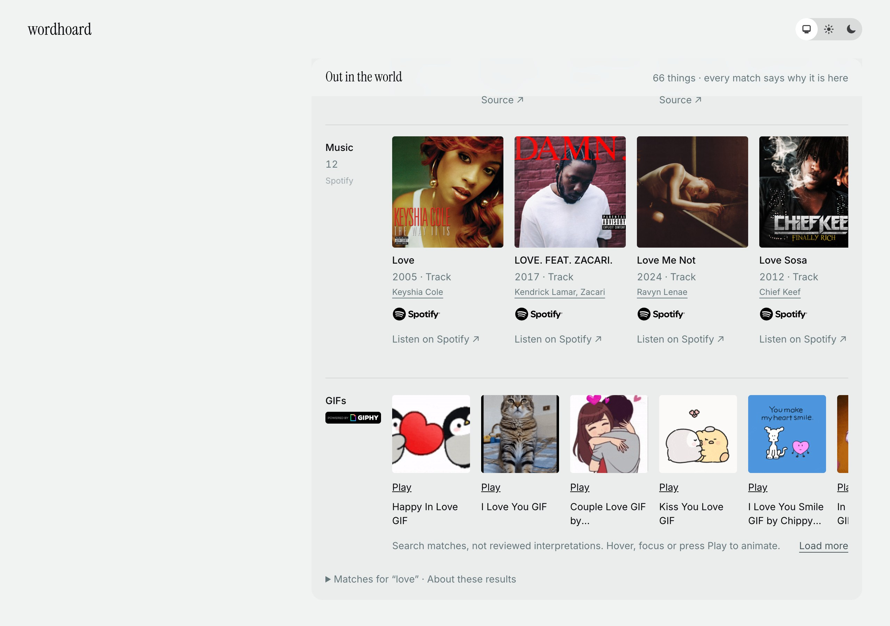
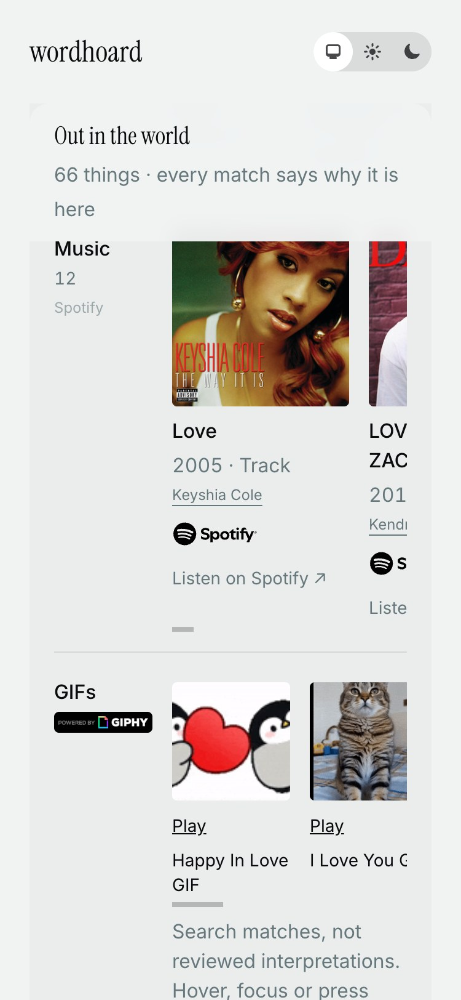
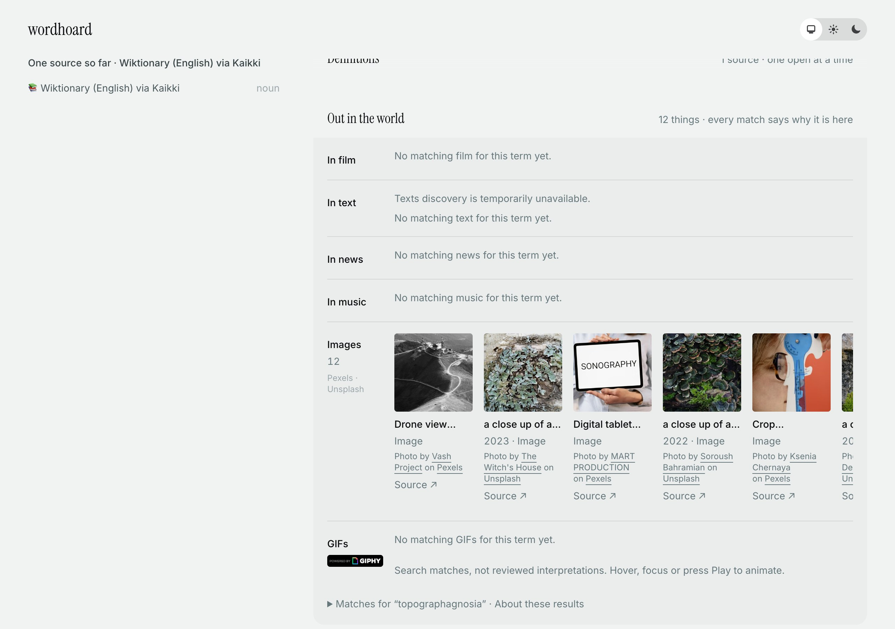
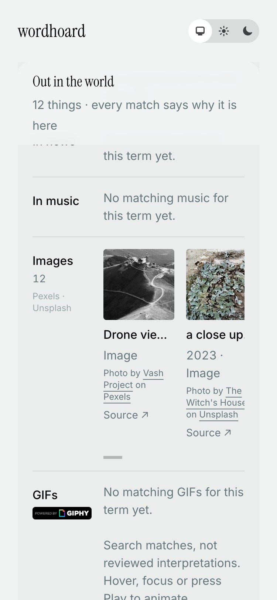
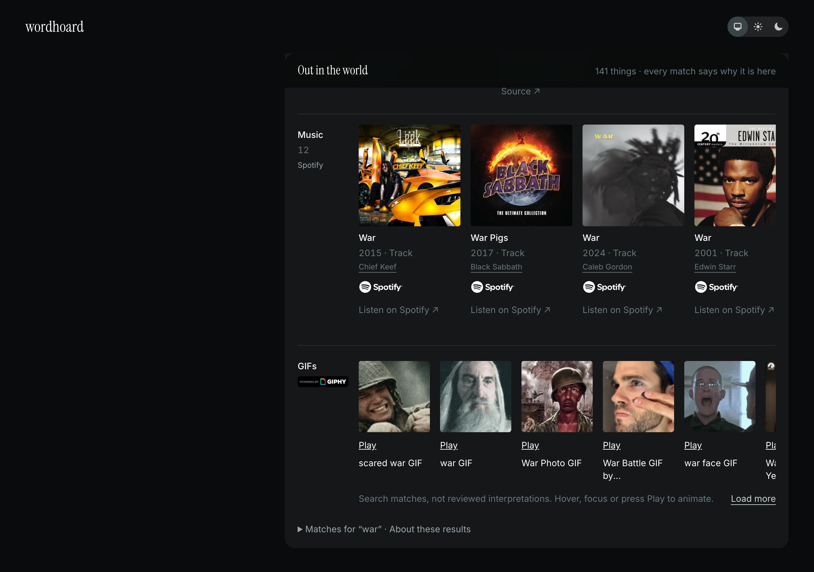

# #143 — the Music shelf, browser proof

2026-09-21. One node on `devils_dictionary_v2`, port 4007, this branch's code.
The checkout that had been serving 4007 (`dictionary-page-mockup-ac2086`, on the
same database) was stopped first, by the owner's instruction: two Oban nodes on
one database steal each other's jobs, and `main` has no Spotify provider to run
the job with.

Screenshots were taken over CDP with `Emulation.setDeviceMetricsOverride`
(375×812×2, mobile) rather than a window size, because a window size is not a
layout viewport.

## The ledger this proof spent

Four rows in `discovery_request_attempts`, for three pages:

| stage | rows |
|---|---|
| `token` | **1** |
| `track_search` | **3** |
| total | **4** |

The token is its own stage and it was minted **once**, for the first page. The
other two pages searched on the same cached token, which is the whole reason
`Spotify.Token` exists.

| run | word | status | reason | scanned | kept | shown |
|---|---|---|---|---|---|---|
| 191 | war | succeeded | `results` | 50 | 21 | 12 |
| 192 | love | succeeded | `results` | 50 | 38 | 12 |
| 199 | topographagnosia | succeeded | **`no_results`** | 50 | **0** | 0 |

`scanned` is what Spotify ranked; `kept` is what the whole-word gate let
through. Reloading any of the three pages afterwards spent **0** — the ledger
was still at 4 after eight polls over sixteen seconds and no new run was
created.

## `/define/war`

A full shelf headed **Music**, bylined *Spotify*, twelve cards. Each card:
square cover art hotlinked from `i.scdn.co`, the track name, `2015 · Track`,
the artist as a link to their Spotify page — that is the `:required` credit —
the **Spotify full logo** beneath it, and *Listen on Spotify ↗*.

Measured in the page rather than read off the picture:

| | |
|---|---|
| cards | 12 |
| credit lines | 12 |
| Spotify marks visible | 12 |
| *Listen on Spotify* links | 12 |
| hosts those links point at | `open.spotify.com`, and nothing else |
| `document.documentElement.scrollWidth` at 375 | **375** — no horizontal page scroll |

## `/define/love`

Also full: twelve of the 38 that passed the gate. *LOVE. FEAT. ZACARI.* is the
multi-artist case — the credit reads *Kendrick Lamar, Zacari*, both names in
Spotify's order.

## `/define/topographagnosia` — the honest empty

No Music shelf, no Spotify mark anywhere on the page, and the page says so in
the one line it reserves for a source that answered nothing:

> **In music** — No matching music for this term yet.

The run is recorded `no_results` having **scanned 50 rows and kept none**,
which is the shape this provider's empty actually has: Spotify does not answer
*nothing*, it answers fifty tracks that are not the word, and the gate refuses
all of them. A reload spent **0**; the negative cache answered.

**#143 named `logomachy` for this proof and `logomachy` is wrong.** Spotify has
six tracks actually called *Logomachy* and the shelf for it is full. The word
here is one of twelve rare lemmas tried before one came back empty —
*borborygmus* has 23, *zugzwang* 26, *quidnunc* 6, *sesquipedalian* 8 — which
is itself the finding: musicians like obscure words, and a rare lemma is not a
reliable way to reach this provider's empty.

## Dark mode

Spotify's Branding Guidelines allow the green logo only on black or white, so
the card carries two files and shows one. Under `prefers-color-scheme: dark`
all twelve visible marks resolve to `/images/spotify-full-logo-white.svg`, and
under light to `…-black.svg`. Not a CSS filter on one file.

## A host with no keys

Same node, restarted with `SPOTIFY_CLIENT_ID=` and `SPOTIFY_CLIENT_SECRET=`
empty, opening a word with no cached Spotify run (`/define/nepotism`):

| | |
|---|---|
| in `:discovery_providers` | **true** — the provider is registered |
| `Spotify.enabled?/0` | **false** |
| Spotify runs created | 0 (still 3) |
| ledger rows spent | 0 (still 4) |
| Spotify marks on the page | 0 |

Which is what a deployment without the credentials should do: no keyless calls,
no half-configured source on a page, and nothing to undo when the keys arrive.
