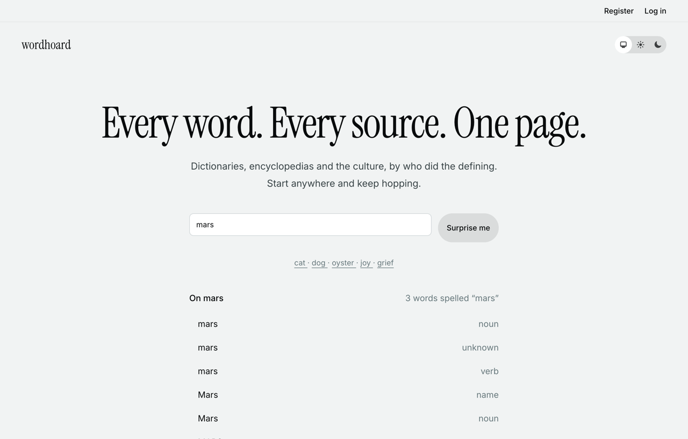
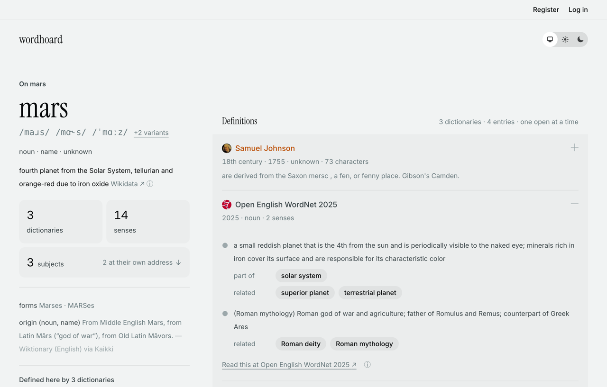
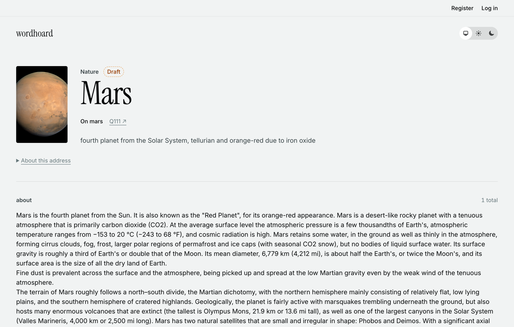
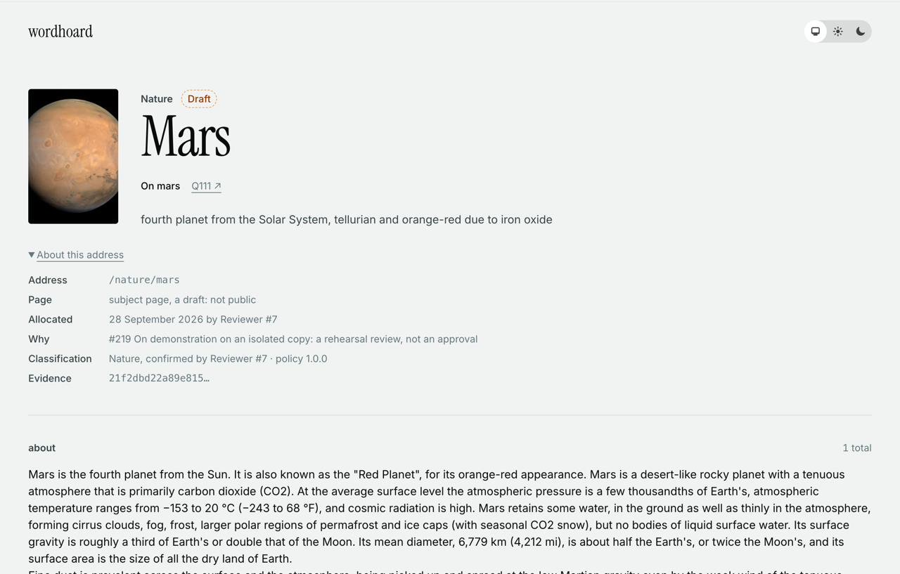
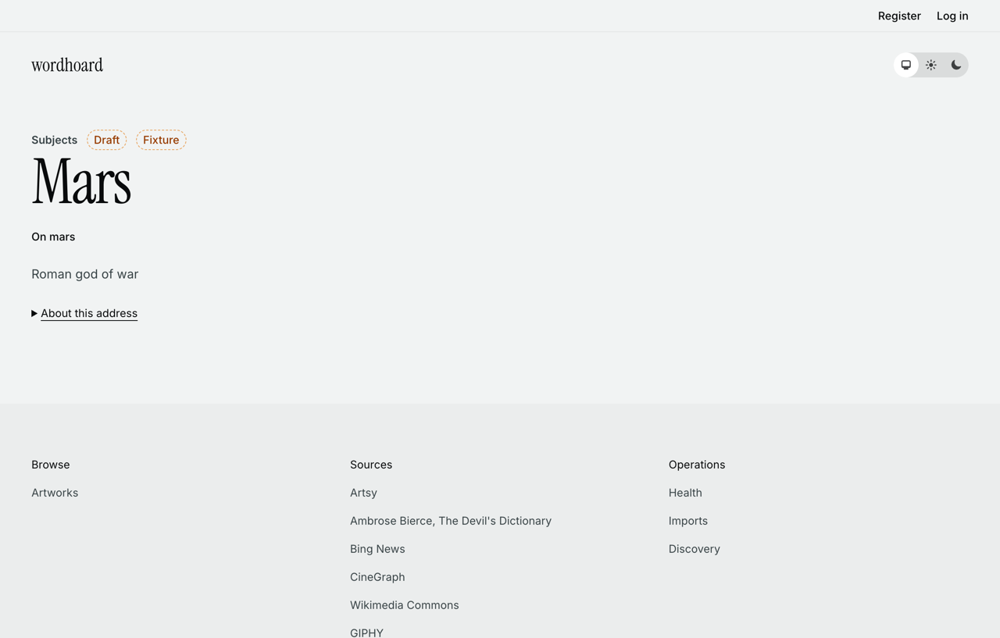
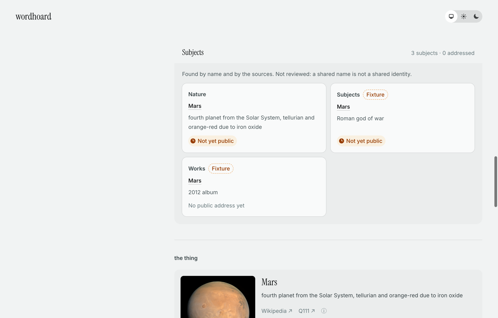
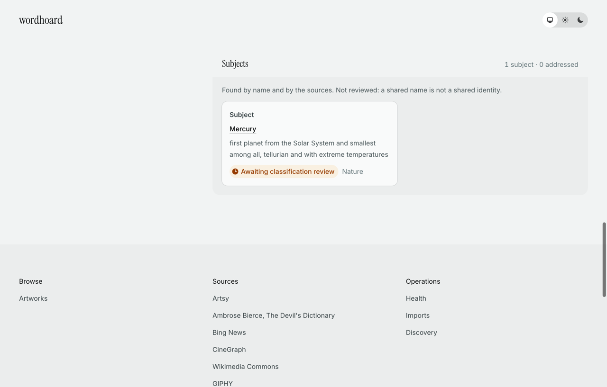
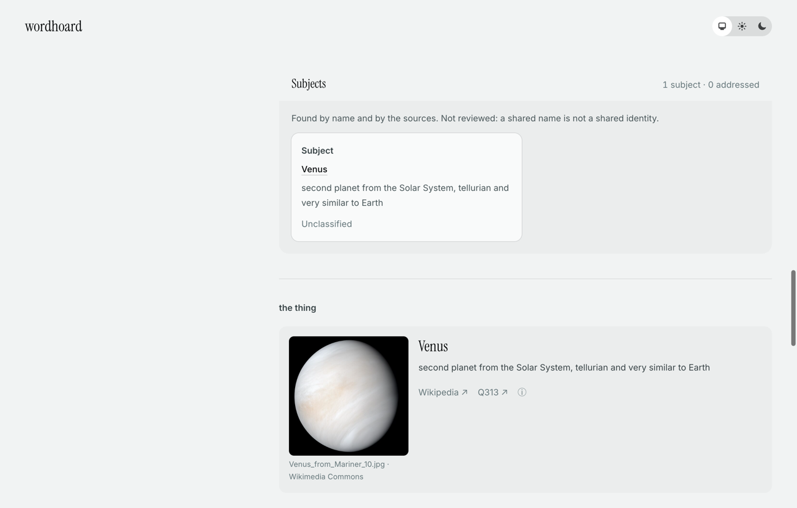
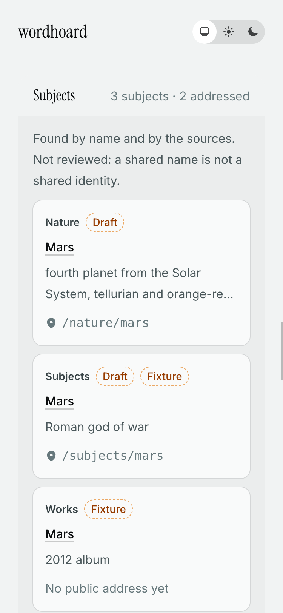

# On → subject, demonstrated from `main` (#219 B7, D5)

On 28 September 2026 the reader was run from `main` at **`04f97bc`**, with #202's curated opening present. It ran against a **disposable copy of the development corpus**, not the owner's working installation. That installation gets reviewed addresses after the storage move ([#211](https://github.com/razrfly/dictionary/issues/211)), in [CP4, #224](https://github.com/razrfly/dictionary/issues/224).

## The copy

`devils_dictionary_stage2r_219final` is on the scratch cluster (port 5433). It was built by `data/audits/2026-09-28-219/demo-final/demo.sh`, a variant of the rehearsal driver in [`backfill.md`](../stage-2/backfill.md#re-run-on-the-corrected-code-219), in these steps:

1. `mix dd.snapshot --restore` of the frozen capture `c1.dump`, then `mix dd.routing.verify` against `devils_dictionary_stage2r_c1`: exact, 69 sections.
2. `mix ecto.migrate`: `20260927200717` and `20260927220937`.
3. Export, audit and population, then the backfill without reviews: 129 awaiting review, 41 not addressed.
4. **Rehearsal reviews** from that run's manifest. They are a rule, not approvals, and the file is marked `"rehearsal": true`. The backfill with them gave 105 allocated, 24 deferred and 41 not addressed. The manifest's records equal the corrected-code rehearsal's, fingerprints included.
5. [`rehearsal/on_demo.exs`](../stage-2/rehearsal/on_demo.exs):
   - the corpus's own Mars (the planet, object 1831413, Q111) is confirmed as Nature by a rehearsal review and allocated `/nature/mars`;
   - a deity **fixture** (3742817) is allocated `/subjects/mars`;
   - an album **fixture** (3742818) gets a draft page and no address.

   Every fixture carries `metadata.fixture` and says so on its card and page. The corpus has no Mars deity or album.

Every page is a draft; nothing is published. Two servers ran from `04f97bc`:
- 4219 reads in **internal** mode (development configuration: drafts shown, marked);
- 4220 reads in **public** mode (`:internal_reading` off for that process).

## The journey (internal mode)

| | |
|---|---|
|  | **Search "mars".** The On row covers the three lemmas spelled *mars*; each of the seven lexemes has its own exact row. Subjects in the results link to their addresses. |
|  | **On mars.** The page names itself, and the rail counts 3 subjects, 2 at their own address. |
|  | **Subjects.** Two cards (the planet, and the deity fixture) show their draft addresses; the album fixture has no public address yet. |
|  | **`/nature/mars`**: Nature, Draft, the way back to On mars, Q111. |
|  | **About this address**: the allocation, and its reason stated as a rehearsal review, not an approval. |
|  | **`/subjects/mars`**: the deity, marked as a fixture. Back and reload return to the same pages. |

## Public mode, and every card state

| | |
|---|---|
|  | **Public `/on/mars`.** The drafts are *not yet public* and link to `/entities/:id/:slug`; no draft address appears anywhere on the page. `/nature/mars` and `/subjects/mars` are 404, and so are `/nature/Mars` and `?mode=internal`. |
|  | **Awaiting classification review**, with the candidate family (Mercury). |
|  | **Unclassified** (Venus): no decision. |
|  | **#202's curated opening** on On love (`?opening=fixture`, its development-only reader), with the Subjects section below. |
|  | **375 px**: no horizontal scroll, and the search On row is a 44 px target. |

Direct requests, in both modes, are recorded in `data/audits/2026-09-28-219/demo-final/http-journey-04f97bc.txt` (local). They are 200, 301 (one hop), 400 and 404 as B2's table requires, and `/define/mars` is 404. The tests cover 410 and 500; the copy has no retired page and no broken ledger state.

`Routing.Subjects.cards/5` was measured on the copy (100,784 entities): 1 to 4 ms for a typical slug, and 44 to 72 ms for a one-letter slug with dozens of lemmas. Pages load in 36 to 122 ms.
